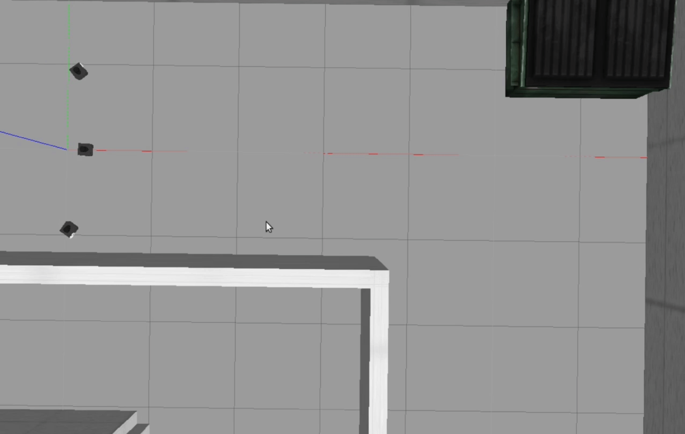

# icar_multi

> 本仓库为icar多机器人编队的ROS功能包

> 注意：本仓库需要icar功能包支持

## 与ICAR相关的仓库

[icar](https://github.com/yltzdhbc/icar.git)：icar机器人ros基础功能包

[icar_multi](https://github.com/yltzdhbc/icar_multi.git)：icar多机编队ros功能包

[icar_base](https://github.com/yltzdhbc/icar_base.git)：icar下位机程序（arduino mega2560）

[icar_manufacture](https://github.com/yltzdhbc/icar_manufacture.git)：icar本体制造相关文件（结构、相关硬件）

## 使用

### 在计算机中仿真

#### 启动仿真环境
```
roslaunch icarmulti_gazebo 3robot.launch
```


#### 启动领航者的导航

```
roslaunch icarmulti_navigation nav_demo.launch
```

#### 启动跟随节点

```
roslaunch icarmulti_formation leader_follower.launch
```


